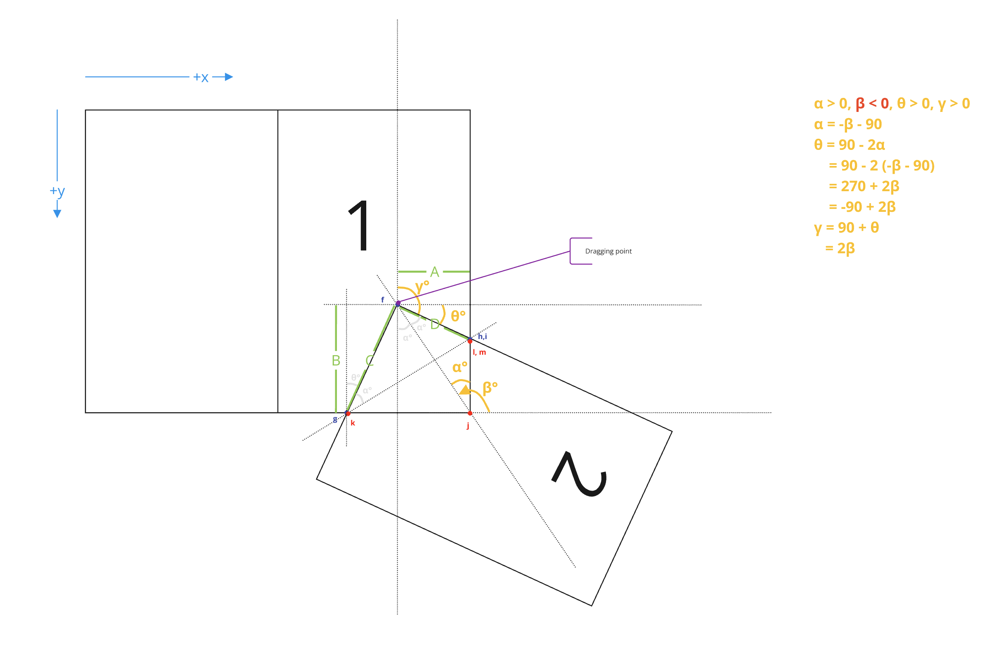
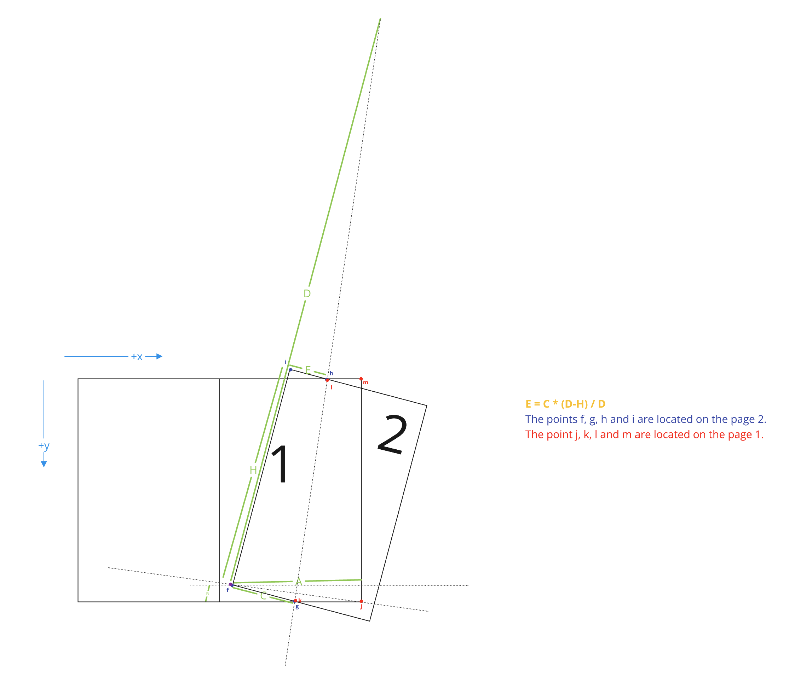
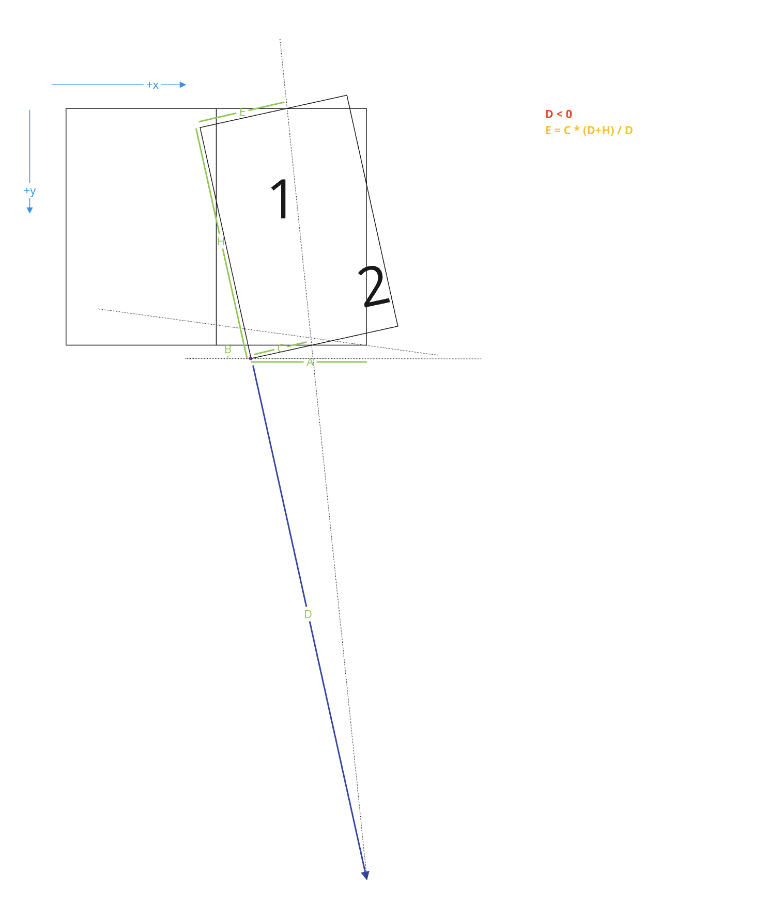
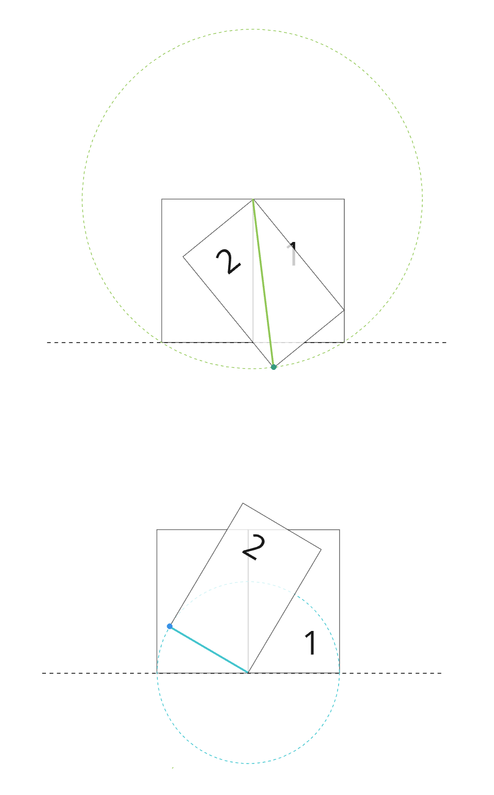
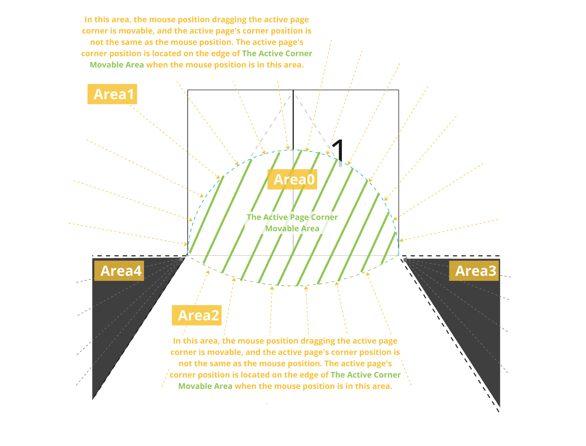
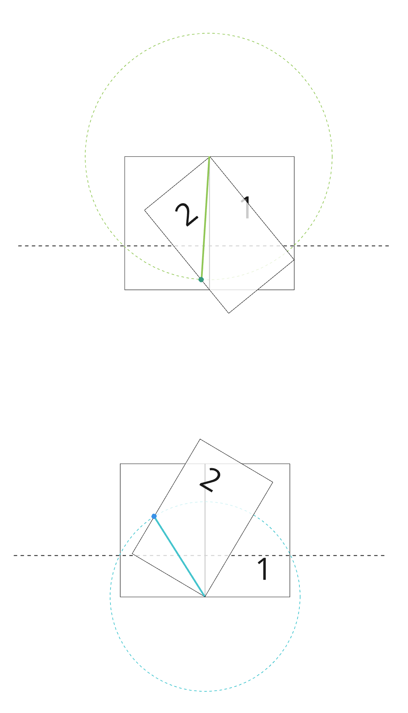
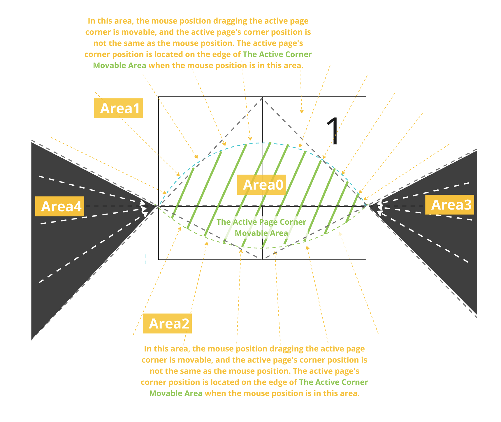

# MagFlip 
***<span style="color:yellow">MagFlip</span>*** is *<u>Magzog</u>'s first open project, implementing a page-flipping effect for books. Additionally, the ***<span style="color:green">MagFlipEditor</span>***, which allows for the creation and editing of books, and the ***<span style="color:green">MagFlipServer</span>***, which manages and serves book information, are also currently in development.
See [demo](https://i486magzog.github.io/magFlip/examples/prebuild/magflip.html).

<span style="color:#888888">[*] "<u>Magzog</u> is a blend of 'magazine' and 'blog.' The idea is to combine printed formats like books, magazines, and newspapers with digital features."</span>


## Usage

### JavaScript module
The first step is to install the Event Calendar `core` package:
```bash
npm install --save-dev @magflip/core @magflip/flipview
```
<span style="color: red; font-weight: bold;">[In Progress]</span> Then install any additional view plugins you plan to use:
```bash
npm install --save-dev @magflip/scrollview
```
<br>

### Pre-built browser ready bundle
Include the following lines of code in the `<head>` section of your page:<br>
Please refer to the [sample code](./docs/examples/prebuild) for more details.
```html
<script src="https://cdn.jsdelivr.net/npm/@magflip/minjs@0.5.44/magflip.min.js"></script>
```

<br>
<br>

## Flip Effect in math




<br>
<br>

## The location of the mouse cursor



